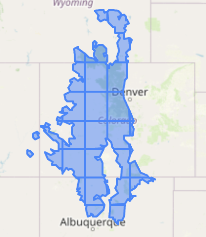
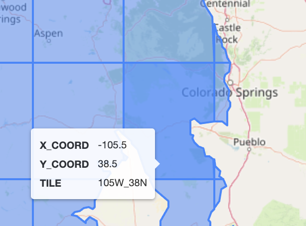
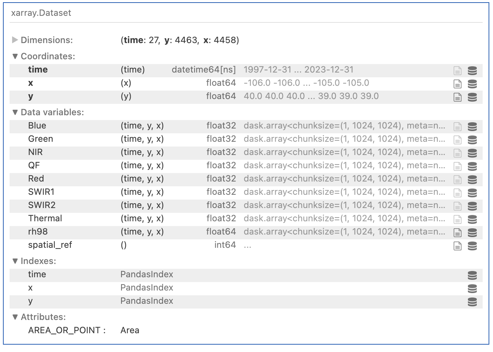
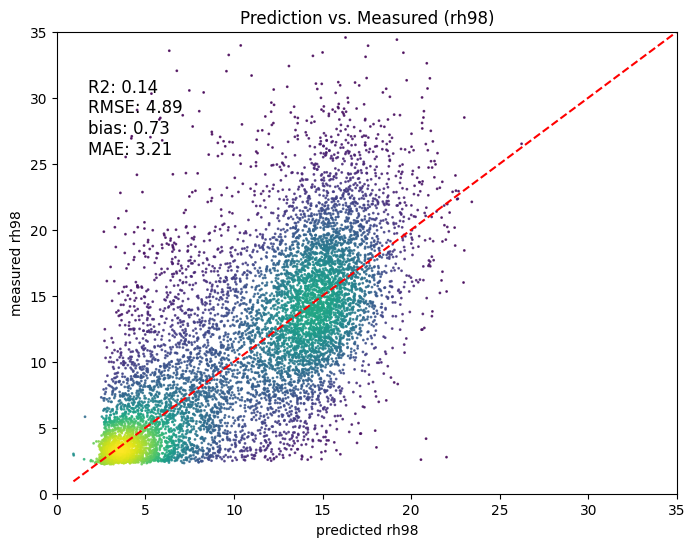
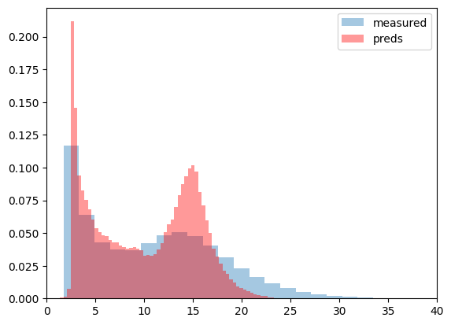

# Presentation

## Introduction:
Satellite remote sensing has revolutionized our understanding of the Earth's surface by providing vast amounts of data covering large spatial extents. However, each remote sensing dataset comes with its own strengths and limitations. In this project, we focus on [GLAD ARD](https://glad.umd.edu/ard/home), which provides analysis ready data using multiple Landsat missions. From the site:

> The Landsat Analysis Ready Data (ARD) created by the Global Land Analysis 
> and Discovery team (GLAD) serves as a spatially and temporally consistent 
> input for land cover mapping and change detection at global to local 
> scales. The GLAD ARD represents a 16-day time series of globally 
> consistent, tiled Landsat normalized surface reflectance from 1997 to the 
> present operationally updated every 16 days.

On the other hand, GEDI Space-borne LiDAR data provides global measurements of forest structure and biomass. This LiDAR is lower resolution than drone or aerial-based LiDAR campaigns, however, it provides sparse global coverage from 2019-2023 at roughly 25m resolution.

Using relatively simple machine learning techniques and combining GLAD ARD with GEDI RH metrics, we are equipped to formulate a model that we can apply back to 1997 to estimate forest metrics. Specically, we train an XGBoost regression model using GLAD-ARD bands as independent variables and GEDI rh98 as the dependent variable. This model, given that it performs well, can then be applied to all GLAD-ARD data generating a proxy for canopy height going back to 1997.

## Objectives:
Model GEDI relative height metric 98th percentile as a proxy for canopy height using GLAD ARD globally consistent and normalized dataset and apply the model to generate wall-to-wall estimates of rh98 from 1997 to 2023 over a reasonable area of interst.

# Methodology:
## Area of Interest
First, we choose an area of interest that is reasonable for the timeframe of the forest carbon codefest. Below we see available GLAD ARD tiles intersecting our eco region:

However, given 16 day intervals from 1997-2023, that is roughly 23 periods * 26 years = 598 "scenes" per tile at approximately 200mb per tile generates about 119Gb of data per tile for full temporal coverage. So, we stick to one tile where we know there was a significant fire:

## Data Preprocessing: 
### GLAD ARD
This dataset is "analysis ready" except for any temporal composition and quality flag masking. To keep things simple, we apply the clear-sky land flag (as described in the GLAD-ARD paper) and simple median composition to general annual mosaics. Below we have a gif of the Red, Blue and Green bands from 1997-2023:

This might not seems very temporally consistent, but this looks fairly decent given the simplicity of the approach. 

**Excercise**: Try comparing this to median composition of Landsat from 1997-2023 to inspect the temporal consistency.

### GEDI rh98
We use the relative height 98th percentile metric as a proxy for canopy height. Earth engine code can be found [here](https://code.earthengine.google.com/f60eee0697f93ad993a2ac91c505dfdf). We apply the simplest quality flag, but it is worth mentioning more sophisticated flags are very helpful depending on the use case which have been investigated thoroughly by the GEDI team.

### Merging Datasets
We simply reproject and resample GLAD ARD to the bounds and geotransform of GEDI data. GLAD ARD provides data in EPSG:4326 and we also export GEDI in EPSG:4326. Lastly, we resample GLAD ARD to match the resolution of GEDI to avoid disturbing our targets as much as possible. It is important to recognize geolocation errors due to resampling and that earth engine likely resampled from a different CRS to EPSGH:4326.

Xarray gives us a nice view of the dataset:

**Note**: All datasets have been made available in zarr format on the team data-store.

### Training Datasets
After we combine all data, we find all pixels where we have valid GEDI rh98 values and extract both the targets and covariates using these indices. We then drop all examples if there are any nan values in the covariates. This gives us shapes ((1072397, 7) for the covariates and (1072397, 1)) for rh98. Lastly, we split the data into train and test splits. Ideally we would spatially split to account for spatial-autocorrelation, which helps when reporting the estimated generalization error of the model. Without splitting spatially in this way, we may get optimistic metrics on our test set.

## Modeling:
We use a gradient boosted regression tree algorithm from XGBoost using the default parameters, but training with the L1 loss objective. Training takes about 30s with minimal memory overhead. Below we have the 1:1 plot from the test set

and a histogram of the predictions and measured values in the test set

**Remarks**:
- As usual in these models, the model struggles to capture the right tail
- The 1:1 plot with density overlay helps us see the bimodal distribution of the targets

## Canopy Height Estimates
Given a trained model and preprocessed GLAD-ARD data, we apply the model to make predictions for every pixel in our aoi from 1997-2023. We build a gif of the predictions for visualization:

We can immediately see that there no data in X that is significantly out of distribution. The temporaly consistent GLAD-ARD data may actually be a suitable input dataset to help expand temporal estimates of canopy structure.

## Follow Up Work
Briefly, items to investigate include:
- better quality flag application for both GLAD and GEDI
- high temporal resolution modeling like quarterly or monthly
- including other covariates like environmental variables, slope, eco-region, etc
- spatial cross validation
- model development including feature engineering, feature selection, hyperparameter tuning
- going beyong pixel-based predictions to take advantage of spatial correlation using neural network approaches
- calibrating GEDI to local ALS
- adding ALS for training
- validating on ALS

## Conclusion:
Our project investigates the usefulness of GLAD ARD when modeling GEDI rh98 as a proxy for canopy height. The benefit of GLAD ARD is the temporal consistency and availability back to 1997. This larger temporal horizon opens up use cases such as discovering aforestation and reforestion sites, check for disturbances farther back in time, etc. We hope this can be a good starting point for followup research!

### References:

[GLAD](https://glad.umd.edu/ard/home) dataset:
Potapov, P., Hansen, M.C., Kommareddy, I., Kommareddy, A., Turubanova, S., Pickens, A., Adusei, B., Tyukavina A., and Ying, Q., 2020. Landsat analysis ready data for global land cover and land cover change mapping. Remote Sens. 2020, 12, 426; doi:10.3390/rs12030426

[Link](https://de.cyverse.org/data/ds/iplant/home/shared/earthlab/forest_carbon_codefest/Team_outputs/Team2?selectedOrder=asc&selectedOrderBy=name&selectedPage=0&selectedRowsPerPage=100) to our datastore.
